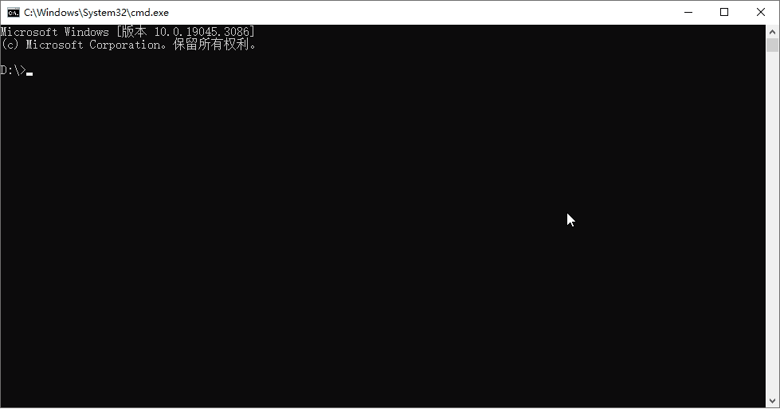

> [!NOTE]  
> 2024/03/27 广东天翼校园网系统升级，接口变更致使此项目失效，项目已停止维护。


## 😎 演示



<br />

## 🔌 接口

此项目采用的是天翼校园网手机客户端的接口协议。如果你的校园网不能用此项目，但可以通过网页认证登录，
可以尝试我的上一个项目 [ESurfingPy-CLI](https://github.com/Pandaft/ESurfingPy-CLI)。
该项目基于 Python 开发，使用网页认证接口，有简单的图形界面可以使用，且有多种自动重登模式可使用。

<br />

## 🔗 依赖

Go 生成的是一个静态可执行文件，除了 glibc 外没有其他外部依赖，如果遇到：

```
./go-esurfing: /lib/x86_64-linux-gnu/libc.so.6: version `GLIBC_2.32' not found (required by ./go-esurfing)
./go-esurfing: /lib/x86_64-linux-gnu/libc.so.6: version `GLIBC_2.34' not found (required by ./go-esurfing)
```

参考网上教程升级 GLIBC 即可。

<br />

## 🍽️ 使用

### 方式一、运行编译的可执行文件（推荐）

> 每次推送新版本，都由 GitHub Action 自动编译部分系统和架构，并发布静态可执行文件。

在 [Release](https://github.com/Pandaft/go-esurfing/releases) 中选择最新版，
选择对应系统和架构，下载并解压，参考下述 “命令行” 使用即可。

### 方式二、运行源码或编译

如果没有符合系统和架构的可执行文件，可以自行编译：

1. 安装 `Go`
2. 配置 `GOPROXY`（非必需，国内环境建议）
3. 克隆仓库：`git clone https://github.com/Pandaft/go-esurfing.git`
4. 进入项目根目录：`cd go-esurfing`
5. 下载依赖：`go mod download`
6. 编译：`go build`
7. 按下述 “命令行” 方式使用编译的可执行文件。

<br />

## 💻 命令行

部分参数说明：

|     参数     |         全称         |         说明          | 
|:----------:|:------------------:|:-------------------:|
|  `nasip`   | net auth server IP | 网络认证服务器 IP ，不同学校不同  |
| `clientip` |     client IP      | 客户端 IP，也就是目标登录设备 IP |

### 帮助

```text
> ./go-esurfing -h

基于 Go 实现登入和登出广东天翼校园网的命令行工具 (v0.2.0)
GitHub: https://github.com/Pandaft/go-esurfing

Usage:
  go-esurfing [flags]
  go-esurfing [command]

Available Commands:
  completion  Generate the autocompletion script for the specified shell
  help        Help about any command
  login       登入
  logout      登出
  version     输出版本

Flags:
  -h, --help   help for go-esurfing

Use "go-esurfing [command] --help" for more information about a command.
```

### 登入

```text
> ./go-esurfing login -h

登入广东天翼校园网

必填参数：username, password

对于 nasip 和 clientip 参数：
  - 本机未登入，且在本机登入时，可不填写
  - 本机已登入，或在远程登入时，必须填写

对于 mac 参数：
  - 暂未发现对登入功能有实际影响
  - 不填写默认为 00-00-00-00-00-00

Usage:
  go-esurfing login [flags]

Flags:
  -n, --nasip    string   认证服务器 IP
  -c, --clientip string   登录设备 IP
  -m, --mac      string   MAC 地址
  -u, --username string   账号
  -p, --password string   密码
  -d, --debug             调试模式
  -h, --help              help for login
```

示例（不要保留 `<` 和 `>`）：

```shell
# 本机登录
./go-esurfing login -u <账号> -p <密码>

# 本机登录，且开启调试模式
./go-esurfing login -u <账号> -p <密码> -d

# 登录指定设备
./go-esurfing login -n <nasip> -c <clientip> -u <账号> -p <密码>
```

### 登出

```text
> ./go-esurfing logout -h

登出广东天翼校园网

必填参数：nasip, clientip

Usage:
  go-esurfing logout [flags]

Flags:
  -n, --nasip    string   认证服务器 IP
  -c, --clientip string   登录设备 IP
  -m, --mac      string   MAC 地址
  -d, --debug             调试模式
  -h, --help              help for logout
```

### 输出版本

```text
> ./go-esurfing version -h

输出当前 go-esurfing 具体版本

Usage:
  go-esurfing version [flags]

Flags:
  -h, --help   help for version
```

<br />

## 📚 参考项目

- [Z446C/ESC-Z](https://github.com/Z446C/ESC-Z/)

<br />

## 📜 开源协议

[GPL 3.0](https://github.com/Pandaft/go-esurfing/blob/main/LICENSE) ，禁止商用。

<br />

## ⚠️ 免责声明

**此项目仅供研究、学习和交流，请勿用于商业或非法用途，
开发者与协作者不对使用者负任何法律责任，
使用者自行承担因不当使用所产生的后果与责任。**

**This project is only for research, learning and exchange.
Do not use it for commercial or illegal purposes.
Developers and collaborators do not assume any legal responsibility for users.
Users bear the consequences and responsibilities arising from improper use.**

<br />

## 👋 结语

广东天翼校园网 QQ 交流群：791455104
（[点此加入](http://qm.qq.com/cgi-bin/qm/qr?_wv=1027&k=yTA84KiemCppMD5Y2CDepUsnVRo59dOS&authKey=CH%2Bb2yFiTVPqLOjdwrEGXGVvmhWTURTFX8yM5eRA7ipWh5fOKAIpJRqCKDIWZT7V&noverify=0&group_code=791455104)）
